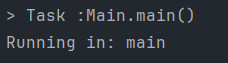

# Answers to Questions
## Question 1: What will be printed after interrupting the thread?
```java

public static class SleepThread extends Thread {
        public void run() {
            try {
                Thread.sleep(10000);
            } catch (InterruptedException e) {
                System.out.println("Thread was interrupted!");
            } finally {
                System.out.println("Thread will be finished here!!!");
            }
        }
    }

    public static void main(String[] args) {
        SleepThread thread = new SleepThread();
        thread.start();
        thread.interrupt();
    }
```
Considering that the join() method was not called after the thread was started,
thread.interrupt() can be executed at the same time as this thread is executed. 
Therefore, before the thread waits for 10 seconds, an exception is encountered.
so "Thread was interrupted!" , and then the statement "finally" is printed.


## Question 2: In Java, what would be the outcome if the run() method of a Runnable object is invoked directly, without initiating it inside a Thread object?

````java
    public static class DirectRunnable implements Runnable {
        public void run() {
            System.out.println("Running in: " + Thread.currentThread().getName());
        }
    }


    public static void main(String[] args) {
        DirectRunnable runnable = new DirectRunnable();
        runnable.run();
    }
````
The "run" method is just a normal call from a class. 
Therefore, no "thread" is created in this case. Therefore, all commands are 
executed by the "main thread".



## Question 3:Elaborate on the sequence of events that occur when the join() method of a thread (let's call it Thread_0) is invoked within the Main() method of a Java program.

```java
public class JoinThread extends Thread {
    public void run() {
        System.out.println("Running in: " + Thread.currentThread().getName());
    }
}

public class Main {
    public static void main(String[] args) {
        JoinThread thread = new JoinThread();
        thread.start();
        try {
            thread.join();
        } catch (InterruptedException e) {
            e.printStackTrace();
        }
        System.out.println("Back to: " + Thread.currentThread().getName());
    }
}
```
When we call the "start" method for a "thread", this "thread" executes its commands concurrently with main.
If we call the join method in a line of code, the lines after it will wait until the commands above it are completely finished.


